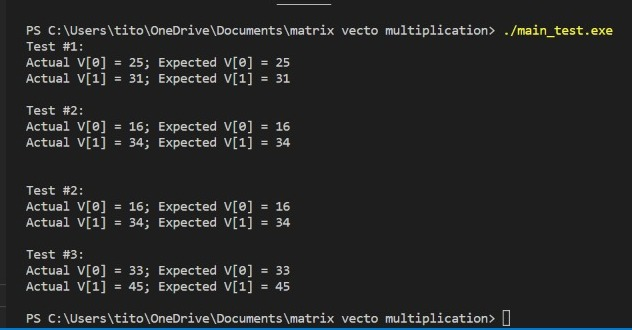

# matrix-vector-mult-benchmark

# Matrix Vector Multiplication Testing Benchmark

## Testing

Run and Output:

Since there are no errors, that means that the testing function works and the function used is successful.

## Benchmark 

### Time complexity

Run and Output:

As you can see, the time takes to complete running the program obviously increases as the value of N increases as well. That data is visualized using this graph:

### Space complexity

Run and Output:

As you can see, the space it takes while running the program obviously also increases as the value of N increases. That data is also visualized using a graph:

